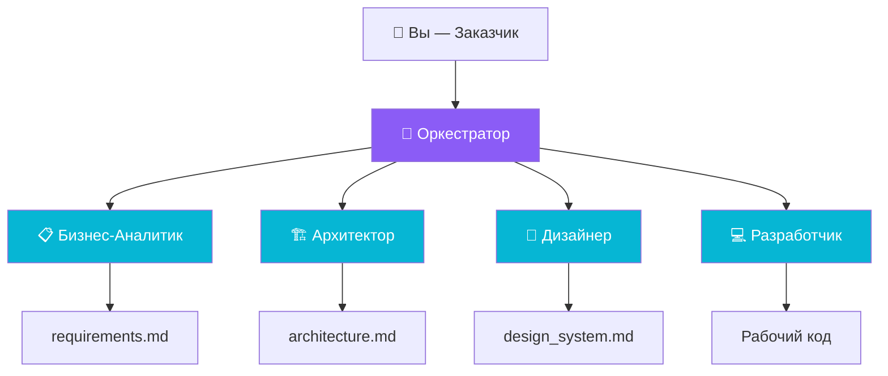
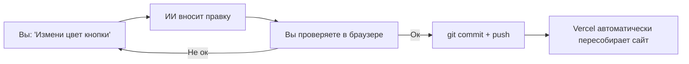

# Регламент Вайбкодинга: от голого компьютера до готового сайта

> Практическое руководство по созданию небольших сайтов (портфолио, лендинги, визитки) с помощью ИИ-агентов. Основано на реальном опыте разработки проекта "E-commerce Iceberg Portfolio".

---

## Фаза 0: Подготовка Рабочего Места (≈30 минут)

Всё, что нужно установить на "голый" Windows-компьютер **до начала работы**.

### Обязательный софт

| # | Что | Зачем | Где скачать |
|---|-----|-------|-------------|
| 1 | **Antigravity IDE** | ИИ-среда разработки (ваш главный инструмент для вайбкодинга) | [antig.ru](https://antig.ru) |
| 2 | **Node.js (LTS)** | Движок для сборки сайта (Astro, Vite и др.) | [nodejs.org](https://nodejs.org/) |
| 3 | **Git** | Версионирование кода и деплой на GitHub | [git-scm.com](https://git-scm.com/download/win) |

### Установка Antigravity IDE

**Antigravity** — это IDE со встроенным ИИ-ассистентом на базе моделей Gemini 3 и Claude Opus. Именно через неё вы будете "вайбкодить": давать задания ИИ-агенту, который пишет код, запускает команды и генерирует изображения.

> [!WARNING]
> **Для пользователей из РФ:** Официальный доступ к Antigravity из России ограничен Google. Обычный VPN часто не помогает — Google анализирует цифровой отпечаток устройства, а российские банковские карты не принимаются для оплаты подписки.

**Решение — сервис [antig.ru](https://antig.ru):**

| Что вы получаете | Детали |
|---|---|
| **Готовый аккаунт** | Уже прошёл верификацию, подписка оплачена картой США/ЕС |
| **Модели** | Claude Sonnet 4.6 / Opus 4.6, Gemini 3 (Low / High / Flash) |
| **AntiG Manager** | Утилита для автопереключения между аккаунтами при достижении лимитов |
| **Без VPN** | Подключился — и работаешь. Никаких прокси и настроек |
| **Оплата** | Посекундная тарификация за время обработки запросов. 1 час серверного времени ≈ 2-3 часа активной работы |

**Шаги установки:**
1. Перейдите на [antig.ru](https://antig.ru) и приобретите серверное время.
2. Скачайте дистрибутив Antigravity IDE (`.exe` для Windows).
3. Установите и авторизуйтесь с полученным аккаунтом.
4. Присоединяйтесь к [Telegram-сообществу](https://t.me/+CoiM5aeDQXU3OWEy) для поддержки и лайфхаков.

> [!TIP]
> **Ориентир по расходам:** 1 час серверного времени — это примерно 30 млн входящих токенов или ~2 пятичасовые квоты тарифа AI Ultra. Для создания небольшого сайта обычно хватает 2-4 часов серверного времени.

### Аккаунты (бесплатные)

| # | Сервис | Зачем |
|---|--------|-------|
| 1 | **GitHub** | Хранение кода в облаке, автодеплой |
| 2 | **Vercel** (или Netlify) | Хостинг сайта (привязывается к GitHub) |
| 3 | **Sanity.io** | Админка для контента (опционально) |

### Починка PowerShell (Windows)

> [!WARNING]
> Windows по умолчанию **блокирует** выполнение скриптов npm/npx. Это нужно починить один раз.

Откройте PowerShell **от имени администратора** и выполните:
```powershell
Set-ExecutionPolicy -Scope CurrentUser -ExecutionPolicy RemoteSigned
```
Введите `Y` и нажмите Enter. Готово навсегда.

**Альтернатива:** Вместо PowerShell использовать обычную командную строку (`cmd`). Все npm-команды работают в ней без ограничений.

---

## Фаза 1: Настройка ИИ-Оркестра (≈15 минут)

### Что такое "Оркестр Агентов"?

Это подход, при котором один ИИ-ассистент (например, Gemini в VS Code) выполняет **разные роли** на разных этапах проекта. Вы не переключаетесь между разными ИИ — вы переключаете **контекст** одного агента.



### Порядок вызова ролей

Роли активируются **последовательно**. Каждая следующая роль опирается на артефакты предыдущей:

```
Оркестратор → Бизнес-Аналитик → Архитектор → Дизайнер → Разработчик
                                                            ↕
                                                     (итерации с вами)
```

---

### 🎯 Роль 1: Оркестратор

**Кто это:** Вы сами + ИИ в режиме "по умолчанию". Оркестратор не пишет код и не рисует — он **управляет процессом**.

| | |
|---|---|
| **Задачи** | Определить цель проекта, выбрать стек, распределить работу по ролям, следить за соблюдением `global_context.md` |
| **Артефакты** | `global_context.md` — "конституция" проекта |
| **Когда активен** | В самом начале и между фазами (при смене ролей) |

**Пример промпта:**
> *"Мы начинаем новый проект — сайт-портфолио для e-commerce директора. Помоги выбрать технический стек и зафиксировать правила проекта в файле global_context.md."*

**Что должно быть в `global_context.md`:**
```markdown
# Глобальный Контекст Проекта

## Технический стек
- Фреймворк: Astro
- Стили: Vanilla CSS (БЕЗ Tailwind)
- Контент: Sanity CMS (Headless)
- Хостинг: Vercel
- Язык интерфейса: Русский
- Язык кода и комментариев: Английский

## Правила
- Весь текст на сайте — через HTML/CSS (не на картинках)
- Mobile-first адаптивность
- SEO: мета-теги, семантический HTML, alt у картинок
```

> [!IMPORTANT]
> `global_context.md` — это документ, который ИИ учитывает **при любой роли**. Если вы запрещаете Tailwind здесь, ни Архитектор, ни Разработчик не должны его использовать.

---

### 📋 Роль 2: Бизнес-Аналитик

**Кто это:** ИИ, который задает вам вопросы и превращает ваши идеи в структурированный документ требований.

| | |
|---|---|
| **Задачи** | Выявить цели сайта, определить целевую аудиторию, составить список разделов и функций, приоритизировать фичи |
| **Входные данные** | Ваш рассказ о проекте в свободной форме |
| **Артефакты** | `requirements.md` |
| **Когда активен** | Фаза 2, Этап 2.1 |

**Пример промпта:**
> *"Сейчас ты — Бизнес-Аналитик. Я хочу сайт-портфолио. Моя аудитория — HR и предприниматели. Мне нужны: главная с вау-эффектом, раздел кейсов с отзывами, блог, контактная форма. Составь requirements.md."*

**Что он должен у вас спросить (если хороший):**
- Кто ваш конкурент? Есть ли референсы?
- Нужна ли мультиязычность?
- Кейсы и отзывы — это одна сущность или разные?
- Нужна ли фильтрация/поиск в блоге?

> [!CAUTION]
> **Анти-паттерн:** Пропустить эту роль и сразу сказать "сделай мне сайт". Без требований ИИ будет угадывать, и результат вас разочарует.

---

### 🏗️ Роль 3: Архитектор

**Кто это:** ИИ, который переводит бизнес-требования в техническую структуру проекта.

| | |
|---|---|
| **Задачи** | Определить файловую структуру, выбрать способ управления контентом, нарисовать карту страниц, описать компонентную модель |
| **Входные данные** | `requirements.md` + `global_context.md` |
| **Артефакты** | `architecture.md` (со схемой в Mermaid) |
| **Когда активен** | Фаза 2, Этап 2.2 |

**Пример промпта:**
> *"Сейчас ты — Архитектор. На основе requirements.md предложи файловую структуру Astro-проекта, нарисуй карту страниц в Mermaid и определи, какие данные будут храниться в Sanity CMS, а какие — статически."*

**Что он должен выдать:**
- Дерево папок (`src/components/`, `src/pages/`, `src/content/`)
- Схему маршрутизации (какие URL существуют)
- Список компонентов и их вложенность
- Решение по хранению данных (CMS vs файлы)

> [!CAUTION]
> **Анти-паттерн:** Позволить Архитектору сразу писать код. Его задача — только **описать** структуру, а не реализовывать.

---

### 🎨 Роль 4: Дизайнер

**Кто это:** ИИ, который определяет визуальный язык сайта и генерирует ключевые визуальные ассеты.

| | |
|---|---|
| **Задачи** | Выбрать цветовую палитру, шрифты, стиль UI-компонентов, сгенерировать концепт-арт (иллюстрации), описать анимации |
| **Входные данные** | `requirements.md` + `architecture.md` + ваши визуальные предпочтения |
| **Артефакты** | `design_system.md`, сгенерированные изображения (концепты) |
| **Когда активен** | Фаза 2, Этап 2.3 |

**Пример промпта:**
> *"Сейчас ты — Дизайнер. Наш сайт — это глубоководная тема (айсберг). Предложи цветовую палитру (Dark Mode), подбери Google Fonts, опиши стиль карточек (glassmorphism). Сгенерируй концепт-арт главной иллюстрации."*

**Что он должен выдать:**
- CSS-переменные (цвета, отступы, радиусы)
- Пару шрифтов (заголовки + текст)
- Описание ключевых UI-паттернов
- Концептуальные изображения (через генерацию картинок)

**Полезные техники:**
- Покажите ИИ скриншот сайта, который вам нравится: *"Сделай в таком стиле"*
- Итеративно уточняйте иллюстрации: *"Увеличь отступы по бокам, верни старые цвета"*
- Сложные иллюстрации лучше заказывать у живого художника, а ИИ-генерации использовать как ТЗ/референсы

> [!CAUTION]
> **Анти-паттерн:** Просить ИИ нарисовать "идеальную картинку" с первого раза. Генерация — это всегда итерации. Закладывайте 3-5 попыток.

---

### 💻 Роль 5: Разработчик

**Кто это:** ИИ, который **пишет код**, настраивает инфраструктуру и запускает dev-сервер. Это единственная роль, которая трогает файлы с кодом.

| | |
|---|---|
| **Задачи** | Инициализировать проект, написать компоненты, стили, скрипты, настроить CMS, подготовить к деплою |
| **Входные данные** | `architecture.md` + `design_system.md` + `global_context.md` |
| **Артефакты** | Весь рабочий код проекта |
| **Когда активен** | Фаза 3 (Разработка), Фаза 5 (Поддержка) |

**Пример промптов:**

| Задача | Промпт |
|--------|--------|
| Создать проект | *"Инициализируй Astro-проект в текущей папке"* |
| Сверстать секцию | *"Реализуй компонент Header с навигацией по нашей структуре из architecture.md. Используй цвета из design_system.md"* |
| Добавить анимацию | *"Добавь параллакс при скролле: плашки должны плавно появляться снизу и исчезать наверх"* |
| Починить баг | *"Картинка растянута по вертикали, пропорции нарушены. Исправь background-size"* |
| Подключить CMS | *"Настрой схемы Sanity для наших кейсов и статей блога"* |

**Ваша задача при работе с Разработчиком:**
1. Проверять результат **в браузере** после каждого изменения
2. Давать конкретную обратную связь (*"Кнопка слишком маленькая"*, а не *"Мне не нравится"*)
3. Утверждать или просить переделать

> [!TIP]
> **Золотое правило:** Один запрос = одна задача. *"Сделай шапку"* → проверили → *"Теперь подвал"* → проверили. Не просите *"Сделай весь сайт целиком"*.

> [!CAUTION]
> **Анти-паттерн:** Давать Разработчику задачу без контекста предыдущих ролей. Если он не видит `design_system.md`, он выберет цвета и шрифты наугад.

---

### Сводная таблица ролей

| Роль | Фаза | Что создает | Что НЕ делает |
|------|-------|-------------|---------------|
| 🎯 Оркестратор | 0-1 | `global_context.md` | Не пишет код, не рисует |
| 📋 Бизнес-Аналитик | 2.1 | `requirements.md` | Не выбирает технологии |
| 🏗️ Архитектор | 2.2 | `architecture.md` | Не пишет код, не выбирает цвета |
| 🎨 Дизайнер | 2.3 | `design_system.md`, концепты | Не пишет код, не меняет архитектуру |
| 💻 Разработчик | 3-5 | Весь код проекта | Не меняет требования без согласования |

---

### Практика: Как создать и настроить агентов в Antigravity

Теперь, когда мы знаем роли, разберём **как именно** их настроить внутри IDE.

#### Способ 1: Файл `global_context.md` (Обязательный)

Это файл в **корне вашего проекта**, который Antigravity автоматически считывает при каждом запросе. Он задаёт **глобальные ограничения**, которые действуют для всех ролей одновременно.

**Создайте файл `global_context.md` в корне проекта:**

```markdown
# Глобальный Контекст Проекта

## Технический стек (ОБЯЗАТЕЛЬНО)
- Фреймворк: Astro (только SSG, без SSR)
- Стили: Vanilla CSS + CSS Variables (Tailwind ЗАПРЕЩЁН)
- Контент: Sanity CMS (Headless)
- Хостинг: Vercel (деплой через GitHub)
- Язык интерфейса: Русский
- Язык кода и комментариев: Английский

## Запреты (НЕЛЬЗЯ нарушать ни в одной роли)
- НЕ использовать Tailwind, Bootstrap и любые CSS-фреймворки
- НЕ размещать текст на иллюстрациях (только HTML/CSS)
- НЕ менять архитектурные решения без согласования с заказчиком
- НЕ устанавливать новые npm-пакеты без объяснения зачем

## Визуальный стиль
- Dark Mode (Deep Ocean Blue + Neon Cyan/Magenta)
- Шрифты: Outfit (заголовки), Inter (текст)
- UI-паттерн: Glassmorphism
- Анимации: Intersection Observer (параллакс при скролле)

## Структура сайта
- Главная: Scrollytelling (Айсберг)
- Разделы: Обо мне, Услуги, Кейсы+Отзывы, Блог, Контакты
- Блог: отдельные страницы /blog/[slug]
```

> [!IMPORTANT]
> Этот файл — ваша **страховка** от того, что ИИ уйдёт "не туда". Если вы написали "Tailwind ЗАПРЕЩЁН", ни одна роль не сможет его подключить.

---

#### Способ 2: Активация роли через промпт (В начале каждой фазы)

При переходе к новой фазе проекта вы отправляете ИИ **стартовый промпт**, который переключает его в нужную роль. Ниже — готовые шаблоны, которые можно копировать.

---

##### 📋 Стартовый промпт: Бизнес-Аналитик

```
Сейчас ты работаешь в роли Бизнес-Аналитика.

Твои задачи:
1. Задать мне уточняющие вопросы о проекте
2. Определить целевую аудиторию
3. Составить список функциональных требований
4. Приоритизировать фичи (MVP vs Nice-to-have)

Твои ограничения:
- НЕ выбирай технологии (это задача Архитектора)
- НЕ предлагай визуальные решения (это задача Дизайнера)
- НЕ пиши код

Результат твоей работы: файл requirements.md

Контекст проекта — в файле global_context.md.

Начинай с вопросов ко мне.
```

---

##### 🏗️ Стартовый промпт: Архитектор

```
Сейчас ты работаешь в роли Архитектора.

Твои входные данные:
- global_context.md (технический стек и ограничения)
- requirements.md (бизнес-требования от Аналитика)

Твои задачи:
1. Предложить файловую структуру проекта
2. Нарисовать карту страниц (в Mermaid)
3. Определить компонентную модель (какие компоненты нужны)
4. Решить, какие данные хранить в CMS, а какие — статически
5. Описать способ обработки форм

Твои ограничения:
- НЕ пиши код (только описания и схемы)
- НЕ выбирай цвета и шрифты (это задача Дизайнера)
- Строго следуй стеку из global_context.md

Результат: файл architecture.md
```

---

##### 🎨 Стартовый промпт: Дизайнер

```
Сейчас ты работаешь в роли UI/UX Дизайнера.

Твои входные данные:
- global_context.md (стек и визуальный стиль)
- requirements.md (кто аудитория, что хотим)
- architecture.md (какие компоненты существуют)

Твои задачи:
1. Определить цветовую палитру (CSS Variables)
2. Подобрать шрифты (Google Fonts)
3. Описать стиль UI-компонентов (карточки, кнопки, формы)
4. Описать анимации и переходы
5. Сгенерировать концепт-арт ключевой иллюстрации

Твои ограничения:
- НЕ пиши код (только описания, токены и картинки)
- НЕ меняй архитектуру и структуру страниц
- Весь текст — только через HTML/CSS, НЕ на картинках

Результат: файл design_system.md + сгенерированные концепты
```

---

##### 💻 Стартовый промпт: Разработчик

```
Сейчас ты работаешь в роли Frontend-Разработчика.

Твои входные данные:
- global_context.md (стек и запреты)
- architecture.md (структура проекта и компоненты)
- design_system.md (цвета, шрифты, стиль компонентов)

Твои задачи:
1. Инициализировать проект (если ещё не создан)
2. Реализовать компоненты согласно architecture.md
3. Применить стили из design_system.md
4. Запустить dev-сервер и убедиться, что всё работает
5. После каждого изменения — ждать моей обратной связи

Твои ограничения:
- Строго следуй стеку из global_context.md
- НЕ устанавливай пакеты без объяснения зачем
- НЕ меняй требования и архитектуру самостоятельно
- Делай по ОДНОЙ задаче за раз, потом жди мою проверку

Начни с: [описание первой задачи]
```

---

#### Способ 3: Gems (Сохранённые роли) — для продвинутых

В Antigravity можно создавать **Gems** — сохранённые профили агентов с предустановленным системным промптом. Это удобно, если вы часто переключаетесь между ролями.

**Как создать Gem:**
1. Откройте настройки Antigravity → раздел **Gems** (или Custom Instructions)
2. Нажмите **"Create Gem"**
3. Задайте имя (например, `🏗️ Архитектор`)
4. Вставьте стартовый промпт из шаблонов выше в поле системных инструкций
5. Сохраните

Теперь вместо копирования промптов вы просто выбираете нужный Gem из списка.

> [!TIP]
> **Лайфхак:** Создайте 4 Gems (Аналитик, Архитектор, Дизайнер, Разработчик) один раз — и используйте их во всех будущих проектах. Меняется только содержание `global_context.md`.

---

## Фаза 2: Проектирование (≈1-2 часа)

Это самая важная фаза. Здесь вы **разговариваете** с ИИ, а не кодите.

### Этап 2.1: Бизнес-Требования

Расскажите ИИ:
- Для кого этот сайт? (целевая аудитория)
- Какую задачу он решает? (найти работу, привлечь клиентов, вести блог)
- Какие разделы нужны?
- Есть ли референсы (сайты, которые нравятся)?

**Результат:** файл `requirements.md`

### Этап 2.2: Архитектура

Попросите ИИ:
- Предложить структуру сайта (карту страниц)
- Определить, откуда берется контент (Markdown, CMS)
- Нарисовать схему в Mermaid

**Результат:** файл `architecture.md`

### Этап 2.3: Дизайн-Система

Обсудите с ИИ:
- Цветовую палитру (светлая/темная тема)
- Шрифты
- Стиль UI (glassmorphism, минимализм, неоморфизм)
- Ключевую визуальную "фишку" (анимация, иллюстрация, параллакс)

**Результат:** файл `design_system.md`

> [!IMPORTANT]
> Все три документа — это ваш **контракт** с ИИ-разработчиком. Чем точнее вы опишете, что хотите, тем меньше итераций правок потребуется.

---

## Фаза 3: Разработка (≈2-4 часа)

Здесь ИИ начинает писать код. Ваша задача — **ревьюить результат в браузере** и давать обратную связь.

### Этап 3.1: Инициализация проекта

ИИ выполнит за вас:
```bash
npx create-astro@latest ./  --template basics --yes --install
```

### Этап 3.2: Фундамент

| Задача | Файл |
|--------|------|
| Глобальные стили (CSS Variables, шрифты) | `src/styles/global.css` |
| Основной Layout (мета-теги, структура) | `src/layouts/Layout.astro` |
| Шапка с навигацией | `src/components/Header.astro` |
| Подвал | `src/components/Footer.astro` |

### Этап 3.3: Секции главной страницы

Попросите ИИ реализовать каждую секцию **по очереди**, проверяя в браузере:

1. Hero-секция (главный экран)
2. "Обо мне"
3. Услуги
4. Кейсы / Портфолио
5. Контактная форма

> [!TIP]
> **Золотое правило вайбкодинга:** Делайте по одной секции за раз. Проверили → одобрили → следующая. Не просите "сделай весь сайт целиком".

### Этап 3.4: Интерактив и Анимации

После того как "скелет" готов:
- Параллакс при скролле (Intersection Observer)
- Hover-эффекты на кнопках и карточках
- Плавные переходы между секциями
- Адаптивность (мобильная версия)

### Этап 3.5: Подключение CMS (опционально)

Если нужна админка для контента:
```bash
npm create sanity@latest
npm install @sanity/astro
```
ИИ настроит схемы данных и GROQ-запросы.

---

## Фаза 4: Деплой и Публикация (≈20 минут)

### Шаг 1: Залить код на GitHub

```bash
git init
git add .
git commit -m "Initial commit: portfolio site"
git remote add origin https://github.com/ваш-логин/ваш-репо.git
git push -u origin main
```

### Шаг 2: Подключить Vercel

1. Зайдите на [vercel.com](https://vercel.com) → авторизуйтесь через GitHub.
2. Нажмите **"Add New Project"** → выберите ваш репозиторий.
3. Framework Preset: **Astro** (Vercel определит автоматически).
4. Нажмите **Deploy**.

Через 1-2 минуты ваш сайт будет жить по адресу `https://ваш-проект.vercel.app`.

### Шаг 3: Привязать домен (опционально)

В настройках проекта на Vercel → Domains → введите ваш домен (например, `ivanov.ru`). Vercel покажет DNS-записи, которые нужно прописать у регистратора домена.

---

## Фаза 5: Итерации и Поддержка

### Цикл внесения изменений



### Обновление контента

| Способ | Когда использовать |
|--------|-------------------|
| **Sanity Studio** | Добавить кейс, статью блога, отзыв |
| **Код (через ИИ)** | Изменить дизайн, добавить секцию, анимацию |

---

## Чек-лист: Готовность к Старту

- [ ] VS Code установлен
- [ ] Node.js установлен (проверка: `node -v` в терминале)
- [ ] Git установлен (проверка: `git --version` в терминале)
- [ ] PowerShell разблокирован (или используете `cmd`)
- [ ] Аккаунт на GitHub создан
- [ ] Аккаунт на Vercel создан
- [ ] (Опционально) Аккаунт на Sanity.io создан

> [!NOTE]
> Весь этот регламент — это то, что мы с вами прошли на практике при создании проекта "E-commerce Iceberg Portfolio". Каждый пункт проверен на реальном опыте, включая все подводные камни с PowerShell и кэшированием картинок в браузере 😄
